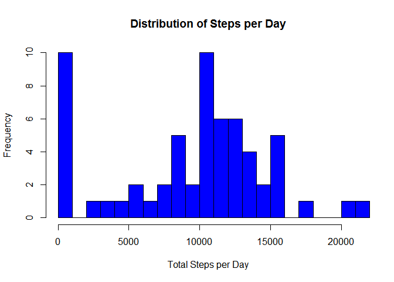
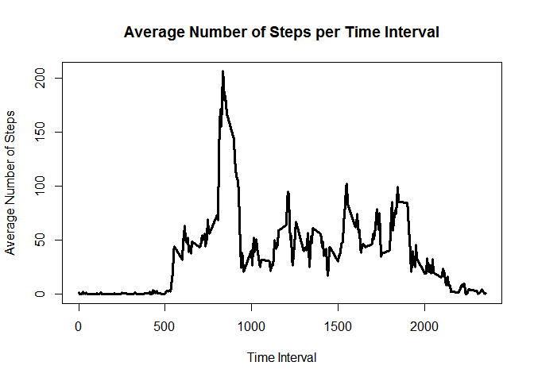
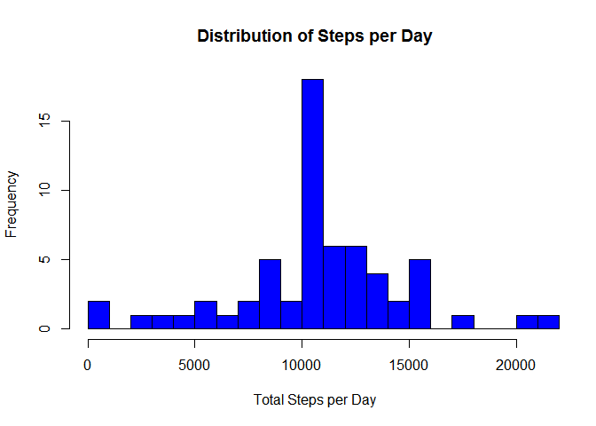
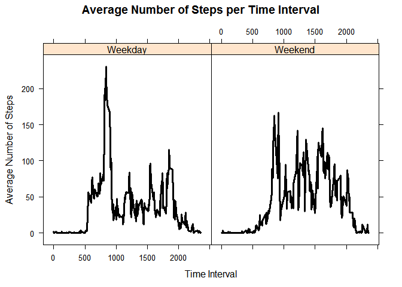

#Activity Monitoring
Corina Schusheim

## Synopsis
An individual wore a personal activity monitoring device from October to November 2012. This device measured the number of steps taken in five minute intervals throughout the day. The analysis is broken into several steps below.

## Analysis


```
## 
## Attaching package: 'dplyr'
```

```
## The following objects are masked from 'package:stats':
## 
##     filter, lag
```

```
## The following objects are masked from 'package:base':
## 
##     intersect, setdiff, setequal, union
```

### Read the data set.

```r
# Download, unzip and remove the compressed data file.
dataFile<-"activity.csv"
if (!file.exists(dataFile)){
    url<-"https://d396qusza40orc.cloudfront.net/repdata%2Fdata%2Factivity.zip"
    zipFile<-"activity.zip"
    download.file(url, zipFile, mode="wb")
    unzip(zipFile)
    file.remove(zipFile)
}

# Read the csv file into a table.
activity<-read.csv(dataFile, header = TRUE, sep=",")
```

### Total Number of Steps Taken Each Day
First let's take a look at the number of steps taken each day in a historgram.


```r
# Calculate the sum of steps taken per day.
days<- activity %>% group_by(date) %>% summarize(totalSteps=sum(steps, na.rm=TRUE))

#Plot a histograms showing the total count of steps per day.
hist(days$totalSteps,
     breaks=25, 
     main="Distribution of Steps per Day", 
     xlab="Total Steps per Day", 
     col="blue", 
     xlim=c(0, max(days$totalSteps))
)
```

<!-- -->

```r
# Calculate the mean and median steps per day.
meanSteps <- format(mean(days$totalSteps), nsmall=2, big.mark = ",")
medianSteps <- format(median(days$totalSteps), nsmall=2, big.mark = ",")
```

The average number of steps per day is 9,354.23.

The median number of steps per day is 10,395.

### Average Daily Pattern
Now let's look at the number of steps for each five minute interval in a day.


```r
# Calculate the sum, mean and median number of steps taken per day.
intervals<- activity %>% group_by(interval) %>% summarize(averageSteps=mean(steps, na.rm=TRUE))

#Plot the average number of steps per each time interval.
plot(intervals, 
     type="l",
     xlab="Time Interval",
     ylab="Average Number of Steps",
     main="Average Number of Steps per Time Interval",
     lwd=3
)
```

<!-- -->

```r
maxInterval<-intervals[intervals$averageSteps==max(intervals$averageSteps),1]
```

The time interval with the greatest average number of steps is 835.

### Imputing Missing Values


```r
# calculate the number of missing rows.
missingCount <- sum(is.na(activity$steps))

# Fill in the missing step count with the average step count for that time interval.
fullActivity<-activity

for(i in 1:nrow(fullActivity)){
    if(is.na(fullActivity[i, 1])){
        fullActivity[i,1]<-intervals[intervals$interval==fullActivity[i,3],2]
    }
}

# Calculate the sum of steps taken per day.
fullDays<- fullActivity %>% group_by(date) %>% summarize(totalSteps=sum(steps, na.rm=TRUE))

#Plot a histograms showing the total count of steps per day.
hist(fullDays$totalSteps,
     breaks=25, 
     main="Distribution of Steps per Day", 
     xlab="Total Steps per Day", 
     col="blue", 
     xlim=c(0, max(fullDays$totalSteps))
)
```

<!-- -->

```r
# Calculate the mean and median steps per day.
meanSteps <- format(mean(fullDays$totalSteps), nsmall=2, big.mark = ",")
medianSteps <- format(median(fullDays$totalSteps), nsmall=2, big.mark = ",")
```

The original dataset has 2304 rows that are missing the number of steps.

The new average number of steps per day is 10,766.19.

The new median number of steps per day is 10,766.19.

### Weekdays vs. Weekends
Let's compare the number of steps taken on weekdays and weekends.


```r
# Add a new column that contans a factor indicating whether the date is a weekday or weekend.
fullActivity$Weekday <- weekdays(as.Date(fullActivity$date))
fullActivity$flag <-ifelse(fullActivity$Weekday %in% c("Saturday", "Sunday"), "Weekend", "Weekday")

# Calculate the sum, mean and median number of steps taken per day.
fullIntervals<- fullActivity %>% group_by(flag, interval) %>% summarize(averageSteps=mean(steps))

#Plot the average number of steps per each time interval for weekdays and weekends.
xyplot(averageSteps~interval|flag, 
    data=fullIntervals, 
    type="l",
    xlab="Time Interval",
    ylab="Average Number of Steps",
    main="Average Number of Steps per Time Interval",
    lwd=3, 
    layout=c(2,1),
    col.line="black",
)
```

<!-- -->
